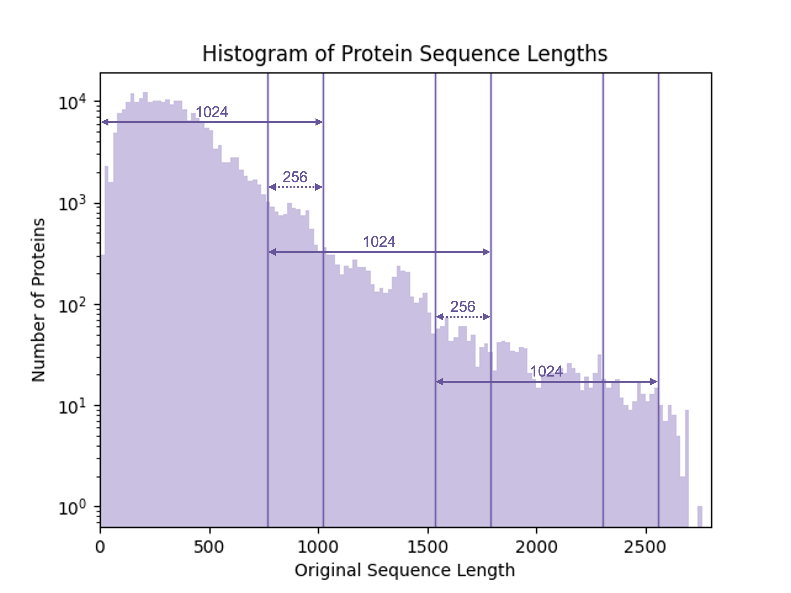

## Sequence Segmentation with Overlapping

Protein sequences can vary dramatically in length, with some exceeding thousands of amino acids. When processing these sequences with models like ESM (Evolutionary Scale Modeling), which have a fixed maximum context window (e.g., 1024 tokens), we must strategically segment extra-long sequences using a sliding window with overlapping to retain meaningful biological information. 

### Motivation

* Model Constraints: Transformer-based models like ESM have a finite context length. Sequences longer than this limit must be split to fit.
* Preserving Local and Global Context: Overlapping segments help mitigate information loss at boundaries by ensuring adjacent segments share some sequence context, reducing edge artifacts.
* Downstream Task Robustness: For tasks like structure prediction or function annotation, continuity between segments improves feature integration.
* Efficient Decoding in Multimodal Pipelines: When feeding protein embeddings into LLM-based decoders (e.g., for protein-text tasks), shorter, segmented inputs prevent excessively long prompts that would otherwise strain memory and computation.

### Sliding Window Segmentation

* Split the sequence into chunks where each new segment starts stride_length = (segment_length − overlap) residues ahead.
* Critical Rule: For any sequence longer than segment_length, the last segment must preserve the final segment_length tokens to avoid truncation.
    * Example: A 1200-residue sequence with *segment_length=1000* and *overlap=200* yields segments [1–1000] and [201–1200] (not [801–1200]). This ensures full coverage of the C-terminus.
* Every segment will be encoded independently with ESM encoder. 
* During the training process of the model, each segment will be considered an a standalone protein sequence and projected to the complete annotation of the original sequence. 
* During inference on given proteins, each segment will be processed then passed to LLM decoder for text generation independently, then all the generated text will be gathered then fusioned with another pretrained LLM. 

By using overlapping segmentation, we balance computational feasibility with biological fidelity, enabling ESM to handle ultra-long sequences effectively for multimodal analysis.

    

